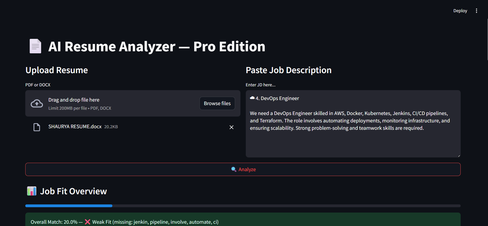
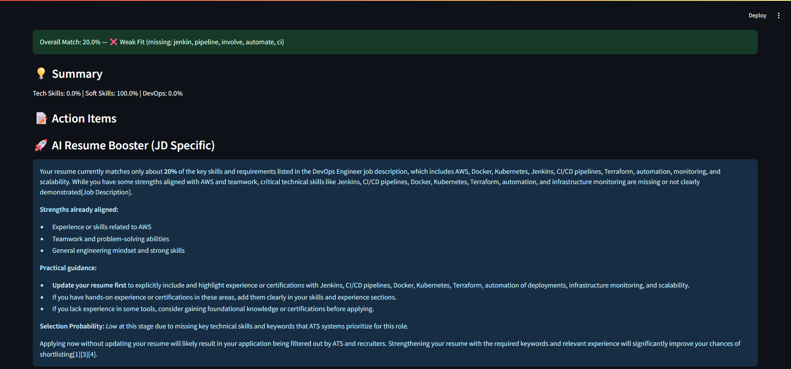
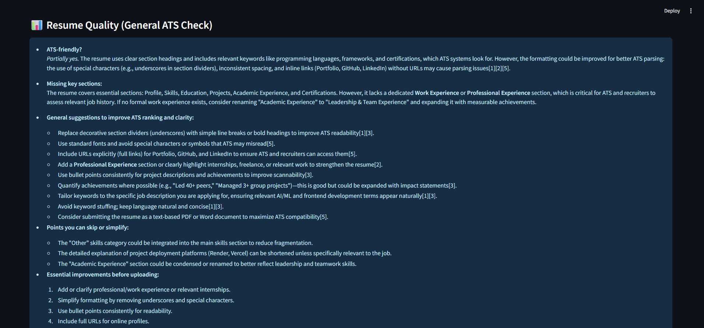

<h1>AI Resume Analyzer — JD-Based Resume Evaluation App</h1>

A web application that analyzes resumes against job descriptions to evaluate <strong>skill match, ATS compatibility, and overall job fit</strong> using AI/ML techniques. Built as a hands-on project to apply Generative AI and NLP concepts learned during AWS AI/ML training.

<h2>📸 Screenshots</h2>

    
    
    

<h2>🎥 Demo Video</h2>

Watch a demo of the Resume Analyzer in action:

<a href="https://www.dropbox.com/scl/fi/5bnimrjb4r7e2ktyezmf2/DemoVideo.mp4?rlkey=czxj1nfxv7kyn3e99rqskr4xu&st=mhosesjs&dl=0" target="_blank">
    ▶ View on Dropbox
</a>

<h2>🚀 Features</h2>
<ul>
    <li>Upload <strong>PDF or DOCX</strong> resumes for analysis</li>
    <li>Detects resume sections: <em>Skills, Projects, Experience, Education</em></li>
    <li>Performs <strong>semantic skill matching</strong> using Perplexity AI API</li>
    <li>Calculates category scores: <em>Tech, Soft, DevOps</em> and overall fit</li>
    <li>Generates <strong>ATS verdict</strong> and actionable recommendations</li>
    <li>Provides <strong>JD-specific AI resume booster</strong> to improve job match</li>
    <li>General resume quality check for <strong>ATS optimization</strong></li>
</ul>

<h2>🛠 Tech Stack</h2>
<ul>
    <li><strong>Backend & UI:</strong> Python, Streamlit</li>
    <li><strong>Resume Parsing:</strong> pdfplumber, python-docx</li>
    <li><strong>NLP & AI:</strong> spaCy, Perplexity AI API</li>
    <li><strong>Environment Variables:</strong> python-dotenv</li>
    <li><strong>Other:</strong> Data cleaning, tokenization, section detection</li>
</ul>

<h2>📂 Project Structure</h2>
<pre>
resume-analyzer/
├── app.py                  # Streamlit app frontend + main logic
├── utils.py                # Helper functions: text cleaning, scoring, AI calls
├── skills_db.py            # Skills database (tech, soft, devops)
├── requirements.txt        # Python dependencies
└── README.md               # This file
</pre>

<h2>💻 Installation & Setup</h2>
<ol>
    <li>Clone the repository:
        <pre>git clone https://github.com/shaurya-tiwari/resume-analyzer.git
cd resume-analyzer</pre>
    </li>
    <li>Install dependencies:
        <pre>pip install -r requirements.txt</pre>
    </li>
    <li>Add your Perplexity API key in a <code>.env</code> file:
        <pre>PERPLEXITY_API_KEY=your_api_key_here</pre>
    </li>
    <li>Run the app:
        <pre>streamlit run app.py</pre>
    </li>
    <li>Open the URL shown in your terminal (<code>http://localhost:8501</code>)</li>
</ol>

<h2>🎯 Usage</h2>
<ol>
    <li>Upload a PDF or DOCX resume.</li>
    <li>Paste the Job Description into the text area.</li>
    <li>Click <strong>Analyze</strong> to get:
        <ul>
            <li>Skill match overview</li>
            <li>ATS verdict</li>
            <li>JD-specific resume booster</li>
            <li>Resume quality insights</li>
        </ul>
    </li>
</ol>

<h2>⚡ Highlights</h2>
<ul>
    <li>Demonstrates practical application of <strong>AI/ML</strong> to real-world HR and recruitment problems</li>
    <li>Integrates <strong>semantic AI</strong> for smarter skill matching</li>
    <li>Provides <strong>actionable feedback</strong> to improve job-fit and ATS ranking</li>
</ul>

<h2>📌 Notes</h2>
<ul>
    <li>Tested with Python 3.10+</li>
    <li>Requires internet access for Perplexity AI API calls</li>
    <li>Streamlit UI provides <strong>easy-to-read insights</strong> for any resume</li>
</ul>
